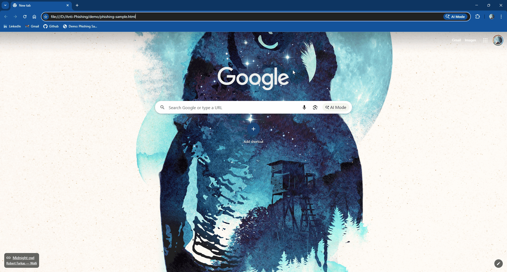

# 🛡️ Anti-Phish — Browser Extension (Manifest V3)


**Anti-Phish** is a lightweight and privacy-first browser extension designed to **detect suspicious or phishing websites** using URL heuristics, DOM inspection, and blocklist checks — all locally, without sending your browsing data anywhere.

Built using **Manifest V3**, **JavaScript**, and **secure content scripting**, this project demonstrates security engineering fundamentals, browser extension architecture, and real-world threat detection logic.

---

## 🚀 Features

### 🔍 Real-time URL Analysis  
- Detects suspicious hostnames  
- Flags phishing-like subdomains (e.g., `secure-login.example.com`)  
- Matches against a built-in blocklist

### 🔐 DOM-Based Detection  
- Detects credential-stealing login forms  
- Alerts on pages attempting to harvest passwords or sensitive input

### 🧱 Fully Client-Side  
- **No data leaves your device**  
- All detection logic runs locally for privacy and speed

### ⚡ Lightweight & Fast  
- No external dependencies  
- Minimal performance overhead  

### 🖥️ Simple, Clean UI  
- Popup panel with *Scan Now*  
- Auto-dismiss security alert banner  
- Report button linking directly to GitHub issues

---

## 📸 Demo (GIF Placeholder)

> 🔧 Place your demo GIF inside: `docs/demo.gif`  
> Then update this line:



---

## 🗂️ Project Structure
```
Anti-Phish/
├── .github/
│   └── workflows/
│       ├── ci.yml
│       ├── ISSUE_TEMPLATE.md
│       └── PULL_REQUEST_TEMPLATE.md
├── demo/
│   ├── phishing-sample.html
│   └── run-demo.sh
├── docs/
│   └── demo.gif
├── icons/
│   ├── icon16.png
│   ├── icon48.png
│   └── icon128.png
├── scripts/
│   └── validate-manifest.js
├── src/
│   ├── background.js
│   ├── content.js
│   ├── popup.html
│   └── popup.js
├── Tests/
│   ├── Cases
│   ├── Manual test
│   └── TESTRESULTS.md
├── manifest.json
├── README.md
├── LICENSE
├── SECURITY.md
├── CONTRIBUTING.md
└── HIGHLIGHTS.md
```
---

## 🛠️ Installation (Developer Mode)

### **Chrome**
1. Visit: `chrome://extensions/`
2. Enable **Developer Mode**
3. Click **Load unpacked**
4. Select the `Anti-Phish/` project folder

### **Firefox (Developer Edition)**
1. Visit: `about:debugging#/runtime/this-firefox`
2. Click **Load Temporary Add-on**
3. Select the `manifest.json` file

---

## 🔬 How It Works (High-Level)
- The **background script** monitors URL changes in real-time  
- The **content script** inspects forms and sensitive elements  
- A built-in **heuristic engine** flags:
  - deceptive subdomains  
  - common phishing keywords  
  - credential-harvesting forms  

Everything runs **locally** — no networking, no data collection.

---

## 📎 Contributing

Contributions are welcome!  
Please read the guidelines in: **`CONTRIBUTING.md`**

---

## 🔒 Security

If you discover a vulnerability, please open a **responsible disclosure** issue or contact me privately.

More details: **`SECURITY.md`**

---

## 📄 License

This project is licensed under the **MIT License**.  
See: **`LICENSE`**

---

## ⭐ Support

If you found this project useful, please give it a **⭐ star** on GitHub — it helps a lot!

